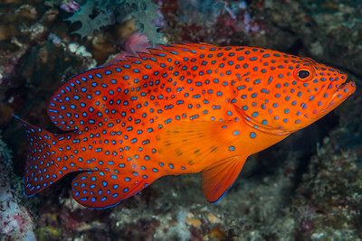

# grouper

find fishy friends from familiar folds



[grouper-flickr]: https://flic.kr/p/YhYRSV

---

## What it do?

_grouper_ makes organizing people into groups a breeze. It accounts for time zones, interests, and group size to create the most optimal groups.

## Getting Started

Install Mamba (lightweight Conda)

```shell
conda install mamba -n base -c conda-forge
```

Install the Mamba environment

```shell
mamba env create --file environment.yaml
```